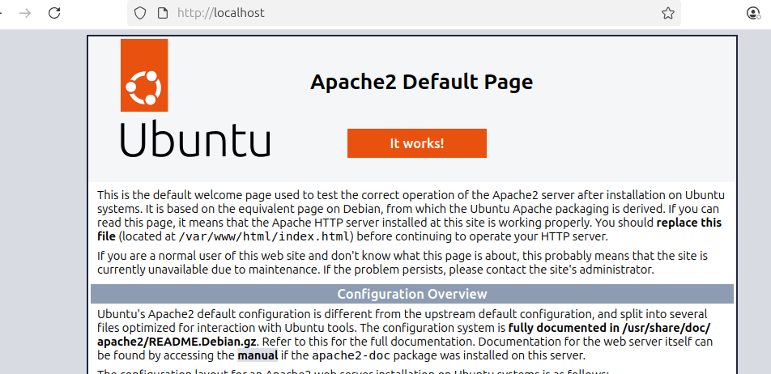
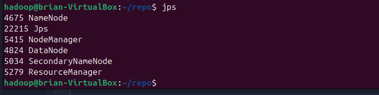
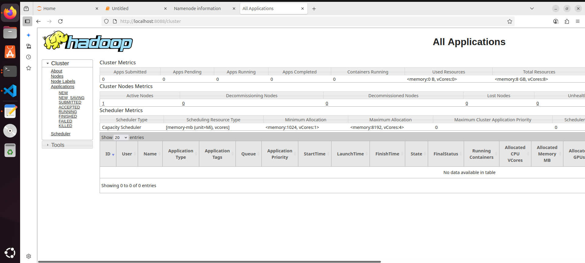
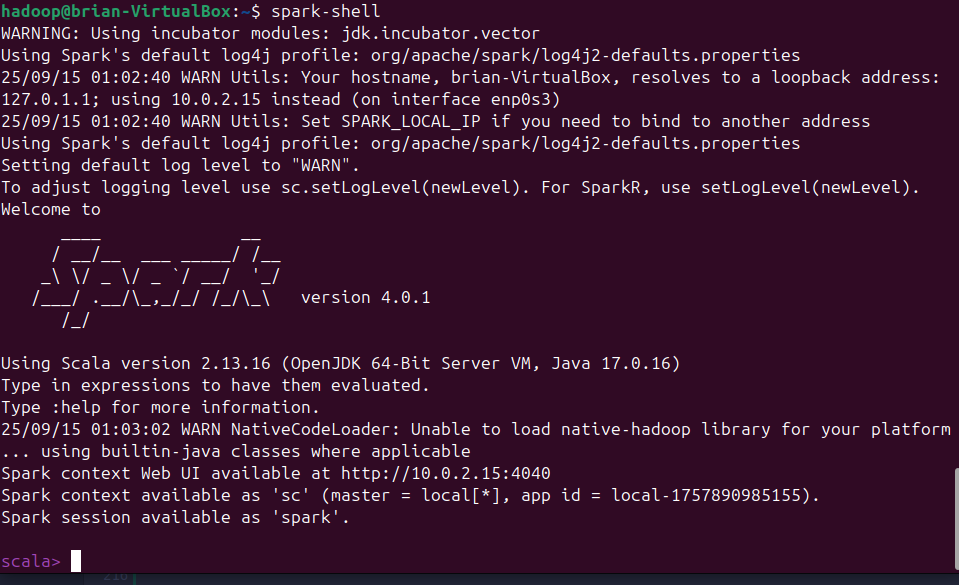

# PySpark Practical

This practical is intended for IndabaX Eswatini 2️⃣0️⃣2️⃣5️⃣. It covers how to setup and run **Apache Server**, **Hadoop**, and **Spark** through the **PySpark API** for _Big Data Analytics and Processing_.

_**Authors: Prof. Stephen Fashoto, Brian Msane, and Bandile Malaza**_\
_**Reviewer: Prof. Stephen Fashoto**_

## Getting Started 💻

For getting started with this practical we need a few things which include:

- WSL (Windows Subsystem for Linux)
- Java 17
- Apache Server
- Spark
- Hadoop
- PySpark
- Jupyter Notebook

Optional

- [Virtualbox](https://dev.to/florianfelsing/how-to-run-an-ubuntu-vm-on-windows-11-4oef)
- [Ubuntu 24.04 LTS image](https://www.virtualbox.org/wiki/Downloads)

  If you are going to be using a virtual machine (VM), powered by Ubuntu operating system, you need to follow the [VM guide](./virtual-machines.md). Once the VM is up an running we can then proceed with the steps below.

## Install WSL and Ubuntu

- On Windows, open `PowerShell` as an **Administrator** and run this command.

```powershell
wsl --install
```

- _Restart your PC if prompted_  and ensure **virtualization** is enabled in **BIOS**. _(Seek help here!)_

## Create `hadoop` User

Open the Ubuntu terminal and create a user called `hadoop`. You will be prompted to provide a _password_. Ensure to save this password as it is going to be needed later.

```bash
sudo adduser hadoop
```

Give privileges to the user.

```bash
sudo usermod -aG sudo hadoop
```

Switch `hadoop`. Once you have successfully created the user, you need to switch to that user using the command below. It will prompt you to provide the password you created above.

```bash
su - hadoop
```

## Clone Repo ✨

Clone this repository to ensure that you have the _shell scripts_ needed for the installation. Run the commands below. They will install git, configure your username and email and then clone this repository into your PC, in the `$HOME` directory.

This will require that you provide your password for the `hadoop` user.

```bash
sudo apt update && sudo apt install dos2unix && sudo apt install git -y
```

Replace **Username** and **Email** with your actual GitHub username and email(if any).

```bash
git config --global user.name "Username" ; git config --global user.email "email@example.com"
```

Run this command to actually get the repository and store it in the `$HOME` directory.

```bash
cd $HOME && git clone https://github.com/BrianMsane/PySpark-Practical.git
```

For ease of use, you should export the path to the shell scripts to be executed. This makes the environment variable only available in the current terminal session so to access it, ensure that you keep this terminal session.

```bash
export SCRIPTS_HOME="$HOME/PySpark-Practical/scripts"
```

Once you have cloned to repository you need to ensure that the shell files are executable by running this command.

```bash
dos2unix $SCRIPTS_HOME/ensure-executable.sh && chmod +x $SCRIPTS_HOME/ensure-executable.sh && bash $SCRIPTS_HOME/ensure-executable.sh
```

## Install Java

Most of the sotfware we're to use require Java to be installed in your system. So, for installing Java, the bash script `java-install.sh` has all the needed commands.

```bash
bash $SCRIPTS_HOME/java-install.sh
```

It should give you the version of Java as in the image below.


## Install Apache Server

Also, run the given script to install Apache Server.

```bash
bash $SCRIPTS_HOME/apache-install.sh
```

To confirm, you need to go to `http://localhost` on your browser and confirm if the output page is as the image below, if yes, congrats you made it 😂!



## Setup SSH

Hadoop requires passwordless SSH for communication between nodes, so configure that using the sript below.

```bash
bash $SCRIPTS_HOME/ssh-setup.sh
```

If you have not configure the password, all you have to do is type `'yes'` and hit `Enter` key twice.

## Download & Install Hadoop

This script `hadoop-setup.sh` will download Hadoop into your system and perform necessary steps and then place it in the right location. Please do expect it to take time as Hadoop file is a huge one (depending on your Internet connection).

```bash
bash $SCRIPTS_HOME/hadoop-setup.sh
```

## Configure Hadoop and Java Environment Variables

We need to configure some environment variables to ensure smooth operation of Java and Hadoop. To do that, we need open the `.bashrc` file and navigate to the last line and then export some environment variables and the command below will do just that.

```bash
bash $SCRIPTS_HOME/env-variables.sh && source "$HOME/.bashrc"
```

## Hadoop Files

Export `JAVA_HOME` in the `hadoop-env.sh` file. To do that, the command below opens the file.

```bash
bash $SCRIPTS_HOME/edit-hadoop-env.sh && source $HADOOP_HOME/etc/hadoop/hadoop-env.sh
```

Create the two mandatory data files for Hadoop information to be kept in. These files are critical for Hadoop Distributed File System (HDFS).

```bash
mkdir -p $HOME/hdfs/{namenode,datanode}
```

Also, We need to edit a couple of Hadoop file to add **configurations**. For each of the file listed below, open the file and then navigate to a section where you have the configurations tags below

```xml
<configurations>
</configurations>
```

and replace these tags with the following `xml` codes corresponding to it.

- Edit core-site.xml

```bash
nano $HADOOP_HOME/etc/hadoop/core-site.xml
```

```xml
<configuration>
  <property>
    <name>fs.default.name</name>
    <value>hdfs://localhost:9000</value>
    <description>The default file system URI</description>
  </property>
</configuration>
```

- Edit hdfs-site.xml

```bash
nano $HADOOP_HOME/etc/hadoop/hdfs-site.xml
```

```xml
<configuration>
  <property>
    <name>dfs.replication</name>
    <value>1</value>
  </property>

  <property>
    <name>dfs.name.dir</name>
    <value>file:///home/hadoop/hdfs/namenode</value>
  </property>

  <property>
    <name>dfs.data.dir</name>
    <value>file:///home/hadoop/hdfs/datanode</value>
  </property>
</configuration>
```

- Edit mapred-site.xml

```bash
nano $HADOOP_HOME/etc/hadoop/mapred-site.xml
```

```xml
<configuration>
<property>
    <name>mapreduce.framework.name</name>
    <value>yarn</value>
</property>

<property>
    <name>yarn.app.mapreduce.am.env</name>
    <value>HADOOP_MAPRED_HOME=${HADOOP_HOME}</value>
</property>

<property>
    <name>mapreduce.map.env</name>
    <value>HADOOP_MAPRED_HOME=${HADOOP_HOME}</value>
</property>

<property>
    <name>mapreduce.reduce.env</name>
    <value>HADOOP_MAPRED_HOME=${HADOOP_HOME}</value>
</property>
</configuration>
```

- Edit yarn-site.xml

```bash
nano $HADOOP_HOME/etc/hadoop/yarn-site.xml
```

```xml
<configuration>
  <property>
    <name>yarn.nodemanager.aux-services</name>
    <value>mapreduce_shuffle</value>
  </property>
</configuration>
```

Now the files are in order 🥂!

## Validate configurations

Finally, validate the Hadoop configuration and format the ``HDFS NameNode``.

```bash
hdfs namenode -format
```

Start the **Hadoop Cluster**.

```bash
start-all.sh
```

To verify whether the services are running as intended, use this command and the output you should get should be similar to the output shown in the image below.

```bash
jps
```



Also, you can access these two addresses `http://localhost:9870` and `http://localhost:9870` in your brower. The latter is for **YARN** while the first one is for **HDFS**.

You should have an output similar to the one on the image below on one of the links.



## Installing Spark

To install Spark, we need to download and move spark to the ideal directory which is `/usr/local/spark` and the shell script below does just that for you, so simply run it.

```bash
bash $SCRIPTS_HOME/spark-setup.sh
```

Thereafter we have to export the environment variable for spark in the `~/.bashrc` file.

```bash
bash $SCRIPTS_HOME/spark-env.sh && source "$HOME/.bashrc"
```

To confirm if `Spark` has been successfully setup, run this command and it should give you an output which is more like the one in the image below.

```bash
spark-shell
```



## Setting up Pip and Virtual Environment

Since `Ubuntu 24.04` comes with `Python 3.12` pre-installed, we have to install `pip3` for managing packages. Also, we have to create a **virtual environments** and install the dependencies like `pyspark` and `jupyter notebook`. The shell script `python-setup.sh` automates the necessary steps.

```bash
bash $SCRIPTS_HOME/python-setup.sh
```

After creating and activating the virtual environment, the scripts will open Juypter Notebook. What you have to do is open your broswer and paste this URL `http://localhost:8888/` in the address bar and then create a **New notebook file**

## Sample Code 🧑‍💻

Insert a cell, insert, and run the code below:

```python
from pyspark.sql import SparkSession

# Create Spark session
spark = SparkSession.builder \
    .appName("simpleapp") \
    .master("local[*]") \
    .getOrCreate()

# Sample data
data = [
  ("Metfula", 25, "Eswatini"),
  ("Elliot", 28, "Zimbabwe"),
  ("Aina", 30, "Namibia")
]

# Create DataFrame
df = spark.createDataFrame(data, ["Name", "Age", "Country"])

# Show data
df.show()
```

The expected output is

```python
+-------+---+---------+
|   Name|Age|  Country|
+-------+---+---------+
|Metfula| 25| Eswatini|
| Elliot| 28| Zimbabwe|
|   Aina| 30|  Namibia|
+-------+---+---------+
```

**Congrats** 🎉🎉🎉, now you are ready for the practical 👨‍💻👩‍💻!
