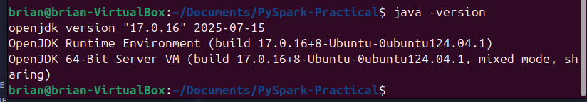

# PySpark-Practical

This practical is intended for IndabaX Eswatini 2025 and we will be learning how to setup and run Apache Server, Hadoop and Spark through the PySpark API for Big Data Analytics and Processing.

## Getting Started

For getting started with this practical we need a few things which are:

- [WSL](https://learn.microsoft.com/en-us/windows/wsl/install)
- Java 17
- Apache Server
- Spark
- Hadoop
- PySpark
- Jupyter Notebook

Optional

- [Virtualbox](https://dev.to/florianfelsing/how-to-run-an-ubuntu-vm-on-windows-11-4oef) and [Ubuntu 24.04 LTS image](https://www.virtualbox.org/wiki/Downloads)

  If you are going to be using a virtual machine (VM), which is powered by Ubuntu 24.04.3 Operating System, for the you need to follow the [virtual machine guide](./virtual-machines.md). Once the VM is up an running we can then proceed with the steps below.

## Install WSL and Ubuntu

- On Windows, open `PowerShell` as an **Administrator** and run this command.

```powershell
wsl --install
```

- _Restart your PC_  and ensure **virtualization** is enabled in BIOS.

## Create `hadoop` User

Open Ubuntu and create a user called `hadoop` and ensure to memorize or save the password.

```bash
sudo adduser hadoop
```

Give privileges to the user.

```bash
sudo usermod -aG sudo hadoop
```

Switch `hadoop`. Once you have successfully created the user, you need to switch to that user using the command below. It will prompt you to provide the password you created for that user.

```bash
su - hadoop
```

## Clone Repo

Clone this repository to ensure that you have the shell scripts which you need to run on your machine for the setup. The script `clone-repo.sh` will automatically install git, configure your username and email and then clone this repository into your PC, in the `$HOME` directory.

Replace **Username** and **Email** with your actual GitHub username and email so that you can be able to clone to repo. This will require that you provide your password for the `hadoop` user.

```bash
sudo apt install git -y && git config --global user.name "Your Name" && git config --global user.email "your_email@example.com" && cd $HOME && git clone https://github.com/BrianMsane/PySpark-Practical.git
```

Once you have cloned to repository you need to ensure that the shell files are executable by running this command.

```bash
chmod +x ensure-executable.sh ; ./ensure-executable.sh
```

## Install Java

Most of the sotfware we're to use require Java to be installed in your system. So, for installing Java, the bash script `java-install.sh` has all the needed commands so, run the file as follows.

```bash
./java-install.sh
```

It should give you the version of Java as in the image below.



## Install Apache Server

Also, run the given script to install Apache Server.

```bash
./apache-install.sh
```

To confirm, you need to go to `http://localhost` on your browser and confirm if the output page is as the image below, if yes, congrats you made it!


## Setup SSH

Hadoop requires passwordless SSH for communication between nodes, so configure that using the command given.

```bash
./ssh-setup.sh
```

If you have not configure the password, all you have to is type `yes` and hit Enter twice.

## Download & Install Hadoop

This script `hadoop-setup.sh` will download Hadoop into your system and perform necessary steps and then place it in the right location. Please do expect it to take time as Hadoop file is a huge one (depending on your Internet connection).

```bash
./hadoop-setup.sh
```

## Configure Hadoop and Java Environment Variables

We need to configure some environment variables to ensure smooth operation of Java and Hadoop. To do that, we need open the `.bashrc` file and navigate to the last line and then paste some export lines and the command below will do just that.

```bash
./env-variables.sh
```

## Edit Hadoop files

Export `JAVA_HOME` in the `hadoop-env.sh` file. To do this, the command below runs a command that automatically does it.

```bash
./edit-hadoop-env.sh 
```

Also, We need to edit a couple of Hadoop file to add configurations. For each of the file listed below, open the file and then navigate to a section where you have

```xml
<configurations>
</configurations>
```

Within these you need to add the configurations under each file.

- Edit core-site.xml

```bash
nano $HADOOP_HOME/etc/hadoop/core-site.xml
```

```xml
<configuration>
  <property>
    <name>fs.defaultFS</name>
    <value>hdfs://localhost:9000</value>
  </property>
</configuration>
```

- Edit hdfs-site.xml

```bash
nano $HADOOP_HOME/etc/hadoop/hdfs-site.xml
```

```xml
<configuration>
  <property>
    <name>dfs.replication</name>
    <value>1</value>
  </property>

  <property>
    <name>dfs.name.dir</name>
    <value>file:///usr/local/hadoop/hadoop_data/hdfs/namenode</value>
  </property>

  <property>
    <name>dfs.data.dir</name>
    <value>file:///usr/local/hadoop/hadoop_data/hdfs/datanode</value>
  </property>
</configuration>
```

- Edit mapred-site.xml

```bash
nano $HADOOP_HOME/etc/hadoop/mapred-site.xml
```

```xml
<configuration>
  <property>
    <name>mapreduce.framework.name</name>
    <value>yarn</value>
  </property>
</configuration>
```

- Edit yarn-site.xml

```bash
nano $HADOOP_HOME/etc/hadoop/yarn-site.xml
```

```xml
<configuration>
  <property>
    <name>yarn.nodemanager.aux-services</name>
    <value>mapreduce_shuffle</value>
  </property>
</configuration>
```

Now the files are in order!

## Validate configurations

Finally, validate the Hadoop configuration and format the HDFS NameNode.

```bash
hdfs namenode -format
```

Start the Hadoop Cluster

```bash
start-all.sh
```

To verify whether the services are running as intented, use this command and the output you should get should be similar to the output shown in the image below.

```bash
jps
```


## Installing Spark

First, we need to download and move spark to the ideal directory which is `/usr/local/spark` and the shell script below does just that for you, so simply run it.

```bash
./spark-setup.sh
```

Thereafter we have to export the environment variable for spark in the `~/.bashrc` file.

```bash
./spark-env.sh
```

To confirm if `Spark` has been successfully setup, run this command and it should give you and output which is more like the one in the image below.

```bash
spark-shell
```


## Setting up Python and Virtual Environment

Since `Ubuntu 24.04` comes with `Python 3.12` pre-installed, we have to install `pip3` for managing packages. Also, we have to create a **virtual environments** and install the dependencies like `pyspark` and `jupyter notebook`. The shell script `python-setup.sh` automates the necessary steps.

```bash
./python-setup.sh
```

After creating and activating the vritual environment, the scripts will open Juypter Notebook. What you have to do is open your broswer and paste this URL `http://localhost:8888/` in the address bar and then create a **New notebook file**

Insert a cell, insert, and run the code below:

```python
from pyspark.sql import SparkSession

# Create Spark session
spark = SparkSession.builder \
    .appName("simpleapp") \
    .master("local[*]") \
    .getOrCreate()

# Sample data
data = [("Metfula", 25, "Eswatini"),
        ("Elliot", 28, "Zimbabwe"),
        ("Aina", 30, "Namibia")]

# Create DataFrame
df = spark.createDataFrame(data, ["Name", "Age", "Country"])

# Show data
df.show()
```

The expected output is

```python
+-------+---+---------+
|   Name|Age|  Country|
+-------+---+---------+
|Metfula| 25| Eswatini|
| Elliot| 28| Zimbabwe|
|   Aina| 30|  Namibia|
+-------+---+---------+
```

Congrats, now you are ready for the practical!
